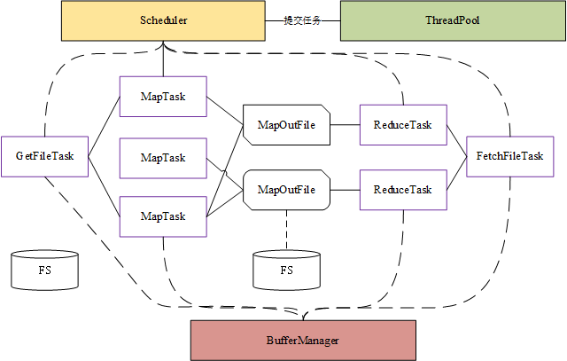
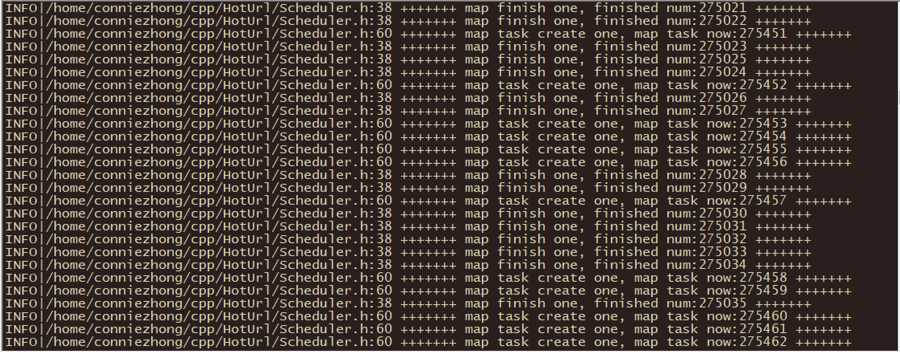
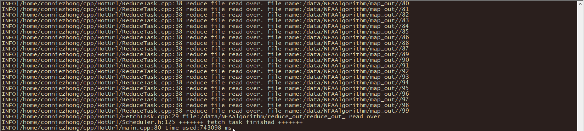
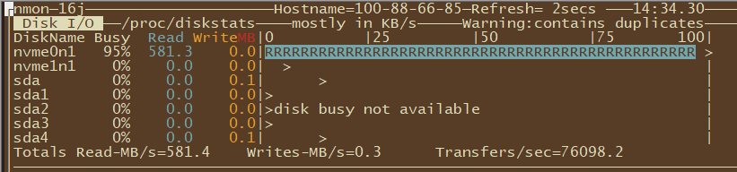

# HotUrl

##本服务架构如下：

* Scheduler
负责调度
* ThreadPool
线程池
* 各种Task
GetFileTask：读取文件到buffe
MapTask：将文件中url hash到不同的子文件，保证相同的url只会落到相同的文件中
ReduceTask：读取文件，利用hash表、小顶堆统计出每个文件中url的次数以及次数topK
FetchTask：对ReduceTask输出的文件再次汇总，采用小顶堆，计算出topK

##优化
输出输出都采用了buffer，多条请求只需要一次IO
采用的buffer管理器，保证堆上内存固定
mapTask采用append方式写文件，全局共用一个fd，减少fd使用次数以及打开关闭文件用的时间

## 测试

* 机器配置
Intel(R) Xeon(R) CPU E5-2680 v4 @ 2.40GHz 
测试使用了8线程
磁盘：使用的网络硬盘，性能暂时未知

* 测试步骤
进入tool目录：
1. 生成测试文件100G
'./gen 20 9000000 10000000 567 /data/home/hoturl/data/
最终文件大小：
du -h --max-depth=1  /data/home/hoturl/data/
111G    /data/home/hoturl/data/
2.  生成中间文件夹
rm -rf  /data/home/hoturl/map_out/ /data/home/hoturl/reduce_out/ /data/home/hoturl/fetch_out/;mkdir /data/home/hoturl/map_out /data/home/hoturl/reduce_out  /data/home/hoturl/fetch_out;
3. 启动程序
限制堆上内存是1G（如果要限制含有栈上的内存，需要把堆上内存总数减少，栈上内存主要消耗是reduce阶段unordered_map）
（输入参数含义依次为: input-path map-out-path reduce-out-path fetch-out-path worker-num buffer-per-line(show be 8 larger than url) map-out-file-num k-op-top-k memory-byte) 
./HotUrl  /data/NFAAlgorithm/data/  /data/NFAAlgorithm/map_out/  /data/NFAAlgorithm/reduce_out/reduce_out_  /data/NFAAlgorithm/fetch_out/fetch_out 8 1000 100 100 1073741824

4. 结果
map数目：312363
reduce数目：100
耗时：743098ms

* 分析
目前打点较少，只给出分析思路：
1. 速度较快其中一个原因也是由于外存访问快
2.  打点读取文件总耗时，cpu总耗时
2. map数目比较多，可以建立MapTask池进行复用
3. 如果是机械盘，调整并发数，使得多线程加速的cpu计算以及多线程写磁盘带来的磁头移动损耗折中

* 运行时部分截图

nmon查看读取峰值：（这个盘应该是比较厉害的）

